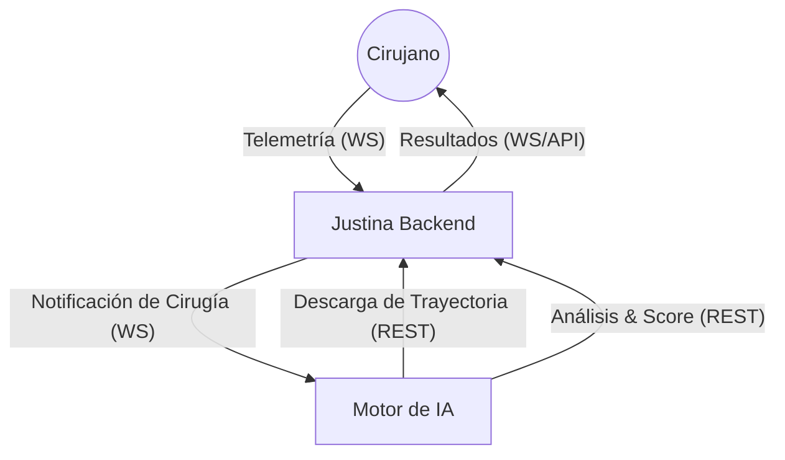

# Justina - Ecosistema de Simulación Quirúrgica con IA

**Bienvenido a Justina**, una plataforma integral de simulación quirúrgica que combina la potencia de un backend robusto con un motor de análisis biomecánico basado en Inteligencia Artificial.

---

## 📖 Documentación Oficial

Puedes acceder a la documentación completa y detallada del ecosistema Justina en el siguiente enlace:

> [!TIP]
> **[Ver Documentación en Mintlify](https://an7h0ny1-justina-core-backend.mintlify.app/introduction)**

---

## 🏛️ Arquitectura del Ecosistema

El proyecto Justina está dividido en dos módulos principales que colaboran estrechamente para proporcionar retroalimentación quirúrgica en tiempo real:

1.  **[Justina Backend](./backend)**: El núcleo del sistema, encargado de la gestión de usuarios, persistencia de datos y comunicación en tiempo real.
2.  **[Justina AI Engine](./ia)**: El motor de análisis encargado de procesar los datos de movimiento y generar métricas de destreza quirúrgica.

---

## 🚀 Componentes

### 📥 [Backend (Spring Boot)](./backend)
Proporciona la infraestructura necesaria para la simulación:
- **Tecnologías**: Java 21, Maven, PostgreSQL/H2, JWT, WebSockets.
- **Funciones**: Streaming de telemetría, gestión de sesiones quirúrgicas, seguridad RBAC.
- **Documentación**: API interactiva con Swagger/OpenAPI.

### 🧠 [Motor de IA (Python)](./ia)
Analiza el desempeño técnico de los cirujanos:
- **Tecnologías**: Python 3.10+, Pandas, WebSockets (STOMP).
- **Procesamiento**: Pipeline de 5 pasos (Ingesta, Cinemática, Alineación, Riesgo, Feedback).
- **Métricas**: Jerk Analysis (fluidez), economía de movimiento, zonificación de riesgo.

---

## 🛠️ Instalación Rápida

Para poner en marcha todo el ecosistema, consulta las guías individuales:

1.  Sigue los pasos en [backend/README.md](./backend/README.md) para iniciar el servidor central.
2.  Configura el motor de IA siguiendo [ia/README.md](./ia/README.md) para comenzar el análisis automático.

---

## 👤 Autor
**Anthony Parra**

---

## 📄 Licencia
Este proyecto está bajo la Licencia MIT. Consulta el archivo [LICENSE](LICENSE) para más detalles.
